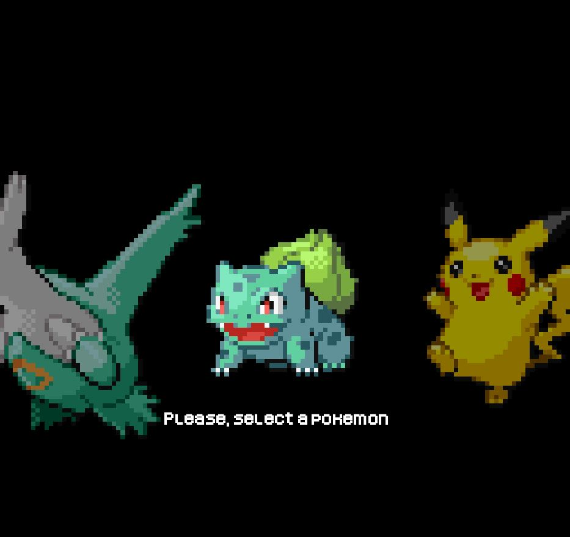

# ICMON

ICMON is a course project (CS-107) aimed to recreate Pokémon Emerald in Java. This project involves replicating core functionalities of the original game, including battle mechanics, exploration, and interaction with various game elements.

## Features

- Battle System
- Exploration and Map Navigation
- Interaction with NPCs and Game Objects

## Screenshots
<div style="display: flex; justify-content: space-around;">
  
  
  
</div>

## Getting Started

### Prerequisites

- Java Development Kit (JDK) 8 or higher

### Installation

1. Clone the repository:
   ```bash
   git clone https://github.com/imruki/ICMON.git

3. Navigate to the project directory:
   ```bash
   cd ICMON

### Running the Game

To launch the game, execute the file Play.java or the following command:
   ```bash
   java -cp icmon/src/main/java ch/epfl/cs107/Play
   ```

## Project Structure

 - icmon/src/main/java/ch/epfl/cs107: Contains the source code for the project
 - game-engine: Includes the game engine used for this project

## Contributing
Contributions are welcome! Please fork this repository and submit pull requests.

## License
This project is licensed under the MIT License - see the [LICENSE](https://github.com/imruki/ICMON?tab=MIT-1-ov-file) file for details.
